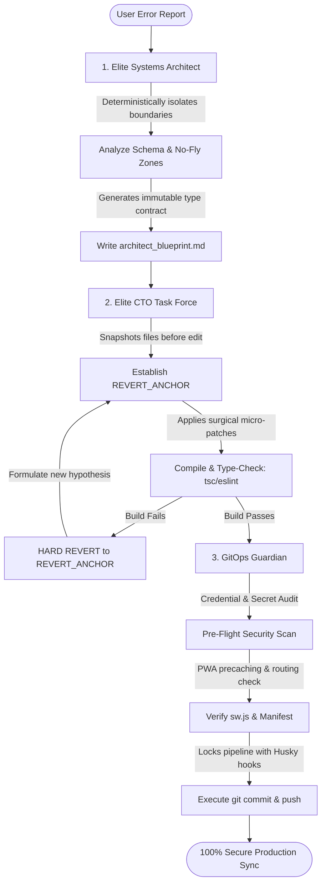

# Medix-AI Ultimate Multi-Agent Tech Team Pipeline
> **METRICS SPECIFICATION (v3.0):** This document defines the formal orchestration standard for all AI agents and engineering tasks in the Medix-AI repository. By dividing concerns into three specialized roles, we eliminate hallucination, guarantee type integrity, and prevent regressions.

---

## 🗺️ Multi-Agent Cooperation Flow

---

## 👥 Role Specifications & Protocols

### 🛡️ Role 1: The Lead Systems Architect (The Anti-Hallucination Firewall)
*   **Location of Rules:** [ARCHITECT_SKILLS/blueprint_generator.md](file:///c:/Users/vivek/PharmaAssist.AI%20Dashboard/medix-ai-dashboard-main/medix-ai-dashboard-main/ARCHITECT_SKILLS/blueprint_generator.md)
*   **Directive:** Act as a firewall against scope-creep. You do **not** write or modify application code. You analyze schemas and isolate file bounds.
*   **Deliverable:** Generates or updates [architect_blueprint.md](file:///c:/Users/vivek/PharmaAssist.AI%20Dashboard/medix-ai-dashboard-main/medix-ai-dashboard-main/architect_blueprint.md) defining:
    - **Target Files to Edit:** Absolute boundaries for file modification.
    - **No-Fly Zones:** Unrelated files that must remain unmodified.
    - **Data shapes:** Strong TypeScript types (no `any`) and database schema parameters.
    - **Defensive Pass Criteria:** The strict compilation, lint, test, and telemetry gates required for success.

### 🩺 Role 2: Elite CTO & Autonomous Debugging Task Force (The Surgeon)
*   **Location of Rules:** [CTO/cto_protocol.md](file:///c:/Users/vivek/PharmaAssist.AI%20Dashboard/medix-ai-dashboard-main/medix-ai-dashboard-main/CTO/cto_protocol.md)
*   **Directive:** Debug errors surgically, keeping edits minimal and fully rollback-safe.
*   **Execution Loop:**
    1.  **Anchor:** Snapshot the initial state of targeted files (`[REVERT_ANCHOR]`).
    2.  **Investigate:** Cross-reference errors against standard stack specs.
    3.  **Patch:** Apply minimal edits, keeping modifications local.
    4.  **Test:** Run `npx tsc --noEmit` and `npx eslint . --quiet`.
    5.  **Gate check:** If build succeeds, transition to deployment. If it fails, trigger a **hard revert** back to `[REVERT_ANCHOR]` immediately. Never try to patch a broken patch.

### 🦅 Role 3: GitOps Guardian (The Sentry)
*   **Location of Rules:** [.agents/skills/gitops-guardian.md](file:///c:/Users/vivek/PharmaAssist.AI%20Dashboard/medix-ai-dashboard-main/medix-ai-dashboard-main/.agents/skills/gitops-guardian.md)
*   **Directive:** Secure release boundaries, prevent key leaks, verify precaching, and synchronize safely.
*   **Audits Performed:**
    - **Secret Scanning:** Scan files and `.env` properties to ensure zero keys or credentials are committed.
    - **Build verification:** Compile clean production bundles (`npm run build`).
    - **Commit Hook enforcement:** Link Husky hooks to enforce pre-commit testing checks (`npm run test && node scripts/diagnose_telemetry.js`).
    - **Push Gate:** Execute secure commits and synchronize with the remote master repository.

---

## ⚡ Step-By-Step Commands For Activation

Whenever you want the tech team to resolve an issue or write a feature, simply instruct the agent:

> `"Tech Team: Resolve [Error/Feature description]"`

The agent will execute:
1.  **Step 1:** Act as the **Systems Architect** and create/update [architect_blueprint.md](file:///c:/Users/vivek/PharmaAssist.AI%20Dashboard/medix-ai-dashboard-main/medix-ai-dashboard-main/architect_blueprint.md).
2.  **Step 2:** Act as the **CTO Task Force**, initialize the anchoring point, and apply the surgical patch.
3.  **Step 3:** Act as the **GitOps Guardian**, run secret scanners, execute the build test suite, and push.
